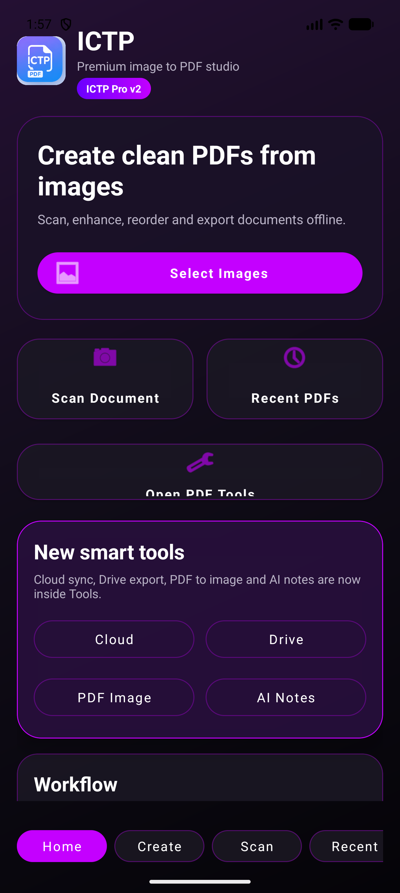

<div align="center">


<br>


<br><br>

# 🌌 ICTP — Premium Image to PDF Studio

### Transform images into beautiful PDFs with a smooth modern experience.


<br>

<p align="center">


</p>

</div>

---

# ✨ About ICTP

ICTP is a premium Android app designed to create clean, fast and professional PDFs from images.  
Built with a modern dark UI and smooth workflow focused on speed, simplicity and productivity.

---

# 🖼 App Preview

<div align="center">



</div>

---

# ⚡ Features

<div align="center">

| 📄 PDF Tools | ⚡ Smart Features | 🎨 Experience |
|---|---|---|
| Image to PDF | AI Notes | Smooth Animations |
| Reorder Pages | Cloud Sync | Modern Dark UI |
| High Quality Export | Drive Export | Premium Design |
| Offline Support | PDF to Image | Fast Workflow |

</div>

---

# 🚀 Workflow

<div align="center">


</div>

---

# 🌟 UI Design

<div align="center">

```text
◉ Neon Purple Theme
◉ Minimal Layout
◉ Smooth Navigation
◉ Modern Card Design
◉ Mobile First Interface
◉ Premium Feel
```

</div>

---

# 🛠 Tech Stack

<div align="center">


</div>

---

# 📂 Project Structure

```bash
ICTP/
│
├── app/
├── assets/
├── gradle/
├── screenshots/
├── docs/
└── README.md
```

---

# ⚙️ Installation

```bash
git clone https://github.com/YOUR_USERNAME/ICTP.git
```

### Open the project in Android Studio and run it.

---

# 📈 Project Vision

ICTP aims to provide a modern all-in-one PDF toolkit with speed, privacy and premium experience while keeping everything lightweight and user-friendly.

---

# 🔥 Upcoming Features

- OCR Text Extraction
- Smart Compression
- Signature Support
- AI Document Cleanup
- Multi Language Support
- PDF Watermark Tools

---

# 🤝 Contribution

Contributions are welcome.  
Feel free to fork the project and improve it.

---

# ⭐ Support Project

If you like this project, give it a star on GitHub.

<div align="center">


### Made with ❤️ by Rishavbuilder

</div>
